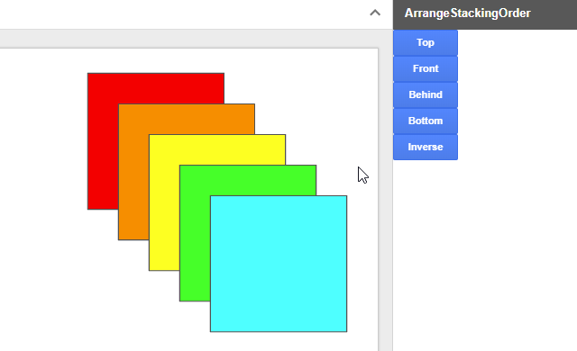

ArrangeStackingOrder
=====

# Overview
**ArrangeStackingOrder is a GAS library for arranging the stacking order of page elements on Google Slides using Google Apps Script (GAS).**

# Demo

This is a demonstration of this library when this is used as a Google Slides Addon.

# Description
Do you have situations that you want to arrange the stacking order of page elements on Google Slides using GAS? I had it before. At that time, I could achieve it by creating a simple script. Recently, I found that users who have the same situation. I thought that if there is a library for this, it will be useful for me and other developers. So I created this. If this was useful for your situation, I'm glad.

# Library's project key
~~~
1YJkHduBJjk7eDbwWCp20YGSjHZsELb4F_q2Fmxs7zgZclZULI84Yjm0f
~~~

# How to install
In order to use this library, please install this as a library.

1. [Install ArrangeStackingOrder library](https://developers.google.com/apps-script/guides/libraries).
    - Library's project key is **``1YJkHduBJjk7eDbwWCp20YGSjHZsELb4F_q2Fmxs7zgZclZULI84Yjm0f``**.

# Usage
- **When you use this library, please select objects on a slide. This library uses the selected objects.**
- **Please use the project of the container-bound script type of Google Slides.**

There are 5 methods in this library.

| Method | Description |
|:---|:---|
| top() | Move to the top of the stacking order. |
| bottom() | Move to the bottom of the stacking order. |
| front() | Move to the 1 step front of the stacking order. |
| behind() | Move to the 1 step behind of the stacking order. |
| inverse() | Inverse the stacking order. |

For each method, ``pageElements`` of selected objects is returned.

# Samples
Before you use this, please install this library.

~~~javascript
var slides = SlidesApp.getActivePresentation();

// top()
var res = ArrangeStackingOrder.getSlides(slides).top();

// bottom()
var res = ArrangeStackingOrder.getSlides(slides).bottom();

// front()
var res = ArrangeStackingOrder.getSlides(slides).front();

// behind()
var res = ArrangeStackingOrder.getSlides(slides).behind();

// inverse()
var res = ArrangeStackingOrder.getSlides(slides).inverse();
~~~

# Principle
In Google Slides, for example, when new shape is created on a slide, the shape is created to the top of the stacking order. At that time, when the change of ``pageElements`` is confirmed, it is found that the created shape is added to the last element to ``pageElements``. This means that the last element is the top of the stacking order. This library was created by using this principle. Although I think that this can be also created by Slides API, in this library, I used the slides service, because Slides API is not required to be enabled.

-----

# Licence
[MIT](LICENCE)

# Author
[Tanaike](https://tanaikech.github.io/about/)

If you have any questions and commissions for me, feel free to tell me.

# Update History
* v1.0.0 (October 10, 2018)

    1. Initial release.

[TOP](#TOP)
